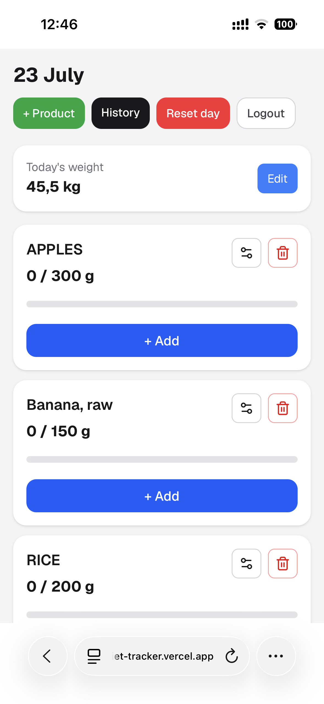
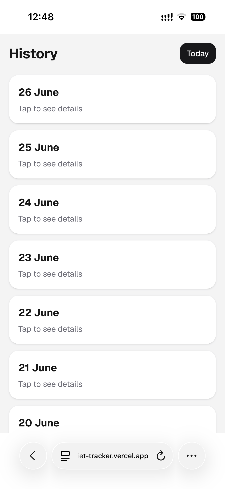
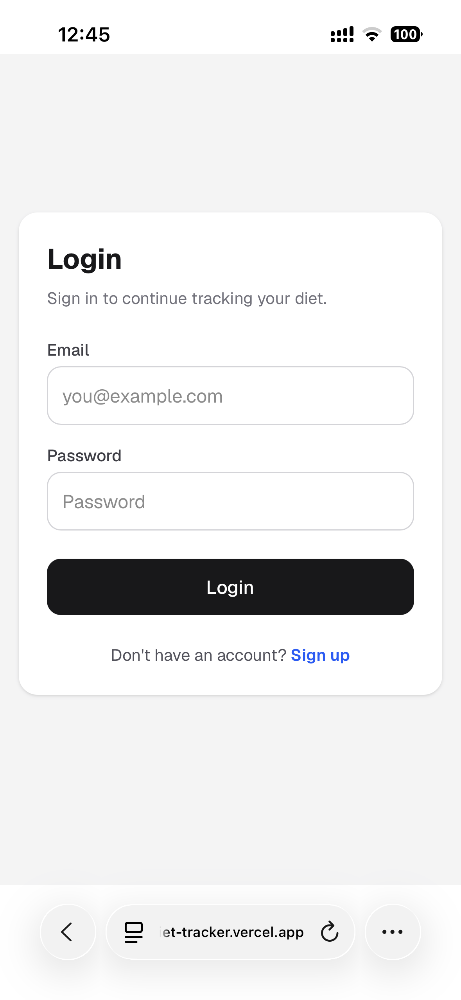

# 🥗 Diet Tracker

A full-stack nutrition tracking application built with **Next.js**, **TypeScript**, and **PostgreSQL**.

Diet Tracker helps users create a personalized daily diet, track food intake, and monitor body weight over time. Each user has their own private account and completely isolated data.

> This project was built as a real-world application to simplify daily nutrition tracking and practice building scalable full-stack architecture.

---

## ✨ Features

### 👤 User Accounts

- Secure authentication
- User registration
- Individual user profiles
- Complete data isolation between users

### 🥦 Diet Management

- Create a personalized daily diet
- Search products from the USDA FoodData Central database
- Add custom products
- Set individual daily limits
- Remove products from the diet

### 🍽 Food Tracking

- Log consumed food
- Edit food entries
- Delete food entries
- Reset an entire day's log
- View previous food history

### ⚖ Weight Tracking

- Save daily body weight
- Update weight records
- Browse weight history

### 🔎 Product Search

- USDA FoodData Central integration
- Product categories
- Fast search
- Custom products support

---

# 🚀 Tech Stack

## Frontend

- Next.js (App Router)
- React
- TypeScript

## Backend

- Next.js Route Handlers
- Repository Pattern
- Service Layer

## Database

- PostgreSQL
- Neon Database

## Authentication

- Auth.js (NextAuth v5)
- Credentials Provider
- bcrypt

## APIs

- USDA FoodData Central API

---

# 🏗 Architecture

The project follows a layered architecture to keep business logic separated from database access.

```
Client
   │
   ▼
Route Handlers
   │
   ▼
Services
   │
   ▼
Repositories
   │
   ▼
PostgreSQL
```

### Repository Layer

Responsible only for database queries.

Examples:

- User Repository
- Food Log Repository
- Product Repository
- USDA Repository
- Daily Weight Repository

---

### Service Layer

Contains business logic.

Examples:

- USDA Import Service
- Product Service

---

# 📂 Project Structure

```
app/
│
├── api/
├── components/
├── history/
├── hooks/
├── login/
├── register/
│
├── HomeClient.tsx
├── layout.tsx
└── page.tsx

lib/
repositories/
services/
types/
public/
```

---

# 🗄 Database

Main tables:

| Table              | Description             |
| ------------------ | ----------------------- |
| users              | Registered users        |
| products           | Available food products |
| product_categories | Product categories      |
| user_diet_items    | User's daily diet       |
| food_logs          | Daily consumed food     |
| daily_weights      | User weight history     |

---

# 🔐 Authentication

Authentication is implemented using **Auth.js (NextAuth v5)** with the Credentials Provider.

Passwords are securely hashed using **bcrypt** before being stored in the database.

---

# 🌎 USDA Integration

The application integrates with the USDA FoodData Central API.

Users can:

- search products
- import nutrition data
- build their own personalized diet

---

# ⚙ Environment Variables

Create a `.env.local` file:

```env
DATABASE_URL=

AUTH_SECRET=
AUTH_URL=http://localhost:3000

USDA_API_KEY=
```

---

# ▶ Running Locally

Clone the repository

```bash
git clone https://github.com/your-username/diet-tracker.git
```

Install dependencies

```bash
npm install
```

Run development server

```bash
npm run dev
```

Open

```
http://localhost:3000
```

---

# 📌 API Overview

### Authentication

```
POST /api/auth/register
POST /api/auth/[...nextauth]
```

### User Diet

```
GET    /api/user-diet-items
POST   /api/user-diet-items
DELETE /api/user-diet-items
```

### USDA

```
GET /api/usda
```

---

# 📸 Screenshots

### Home



---

### History



---

### Login



---

# 💡 Future Improvements

- Dashboard with nutrition statistics
- Charts for weight progress
- Weekly and monthly reports
- Barcode scanner
- Meal planning
- Favorite products
- Mobile-first UI improvements
- Dark mode

---

# 🎯 What I Practiced

While building this project I practiced:

- Full-stack application architecture
- Authentication with Auth.js
- PostgreSQL database design
- Repository Pattern
- Service Layer
- API development with Route Handlers
- CRUD operations
- TypeScript
- External API integration
- Data validation
- Clean project structure

---

# 📄 License

This project is available under the MIT License.
